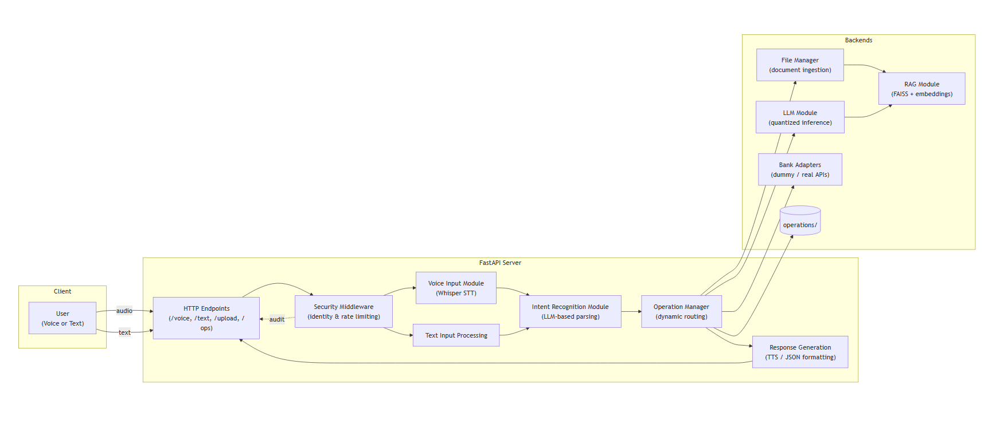

# AI_FINANCE_ACCOUNTANT_AGENT Documentation

Welcome to the **AI_FINANCE_ACCOUNTANT_AGENT** comprehensive documentation. This guide covers everything from high‑level architecture to module internals, API endpoints, testing, and extension points—crafted to impress stakeholders and onboard developers swiftly.

---

## 1. Introduction

AI_FINANCE_ACCOUNTANT_AGENT is a cutting‑edge, open‑source, voice‑activated finance accounting assistant. It leverages state‑of‑the‑art open‑source technologies:

- **Speech Recognition**: Whisper (STT)
- **Large Language Models**: Quantized LLMs via Hugging Face Transformers
- **Retrieval‑Augmented Generation**: FAISS + sentence‑transformers
- **Web Framework**: FastAPI
- **TTS**: Mozilla TTS / pyttsx3

The agent dynamically executes finance operations (e.g., cash management, risk analysis, tax reporting) through an API‑first design, mapped from voice commands to modular handlers.

---

## 2. High‑Level Architecture

- **FastAPI Server (`main.py`)**: Entrypoint routes requests, integrates middleware for auth, rate limiting, and file upload.
- **Voice Input Module**: Processes audio uploads via Whisper, returns transcripts.
- **Intent Recognition**: Uses LLM to parse transcripts into structured `intent`, `subintent`, `entities`, and `confidence`.
- **Operation Manager**: Dynamically discovers `handle_<subintent>` in `modules/operations/` and executes appropriate handler.
- **Bank Adapters**: Abstracts banking API (dummy or real) for balances, transfers, transactions, portfolios.
- **File Manager & RAG**: Ingests PDFs/CSVs/DOCX into FAISS index for context augmentation in LLM prompts.
- **Response Generation**: Formats JSON or human‑readable responses, optionally synthesizes speech.
- **Security**: JWT auth, input sanitization, rate limiting, and audit logging.

---

## 3. Detailed Module Overview

### 3.1 `config/settings.py`
- **Type**: Pydantic `BaseSettings`  
- **Responsibilities**: Load environment variables, validate, set defaults, create directories.  
- **Key Configs**: LLM model name & quantization, STT/TTS settings, API keys, directory paths, rate limits.

### 3.2 `main.py`
- **Type**: FastAPI application  
- **Features**:
  - Startup events: load models, initialize RAG index.  
  - Endpoints:
    - `/voice` (POST): Upload audio → transcript → intent → operation → response.
    - `/text` (POST): Direct text input.
    - `/upload` (POST): Document ingestion.
    - `/ops` (GET): List available operations.
    - `/auth/token` (POST): JWT token issuance.

### 3.3 `modules/voice_input.py`
- **Core**: Async Whisper model loader + transcript extraction.  
- **Error Handling**: Clean temp files, propagate descriptive errors.

### 3.4 `modules/intent_recognition.py`
- **Taxonomy**: Predefined finance intent/subintent mapping.  
- **Logic**: Prompts LLM with taxonomy, extracts JSON.  
- **Output**: Standardized JSON schema for downstream routing.

### 3.5 `modules/llm_module.py`
- **Loading**: Quantized (4‑bit/8‑bit) or full‑precision.  
- **Inference**: Async with `asyncio.wait_for` timeout.  
- **Streaming**: Supports `stream` flag for real‑time clients.
- **Fallback**: Configurable fallback text on timeout or errors.

### 3.6 `modules/rag_module.py`
- **Doc Chunking**: Sentence‑transformers for embeddings.  
- **Indexing**: FAISS IndexFlatL2; persisting to disk.  
- **Search**: Nearest neighbors + metadata filtering.  
- **Context Generation**: Collates top K docs into prompt augmentation.

### 3.7 `modules/operation_manager.py`
- **Discovery**: Scans `modules/operations/*.py`, registers `handle_` coroutines.  
- **Execution**: Matches `(intent, subintent)` → handler; measures execution time; captures success/error metadata.

### 3.8 `modules/file_manager.py`
- **Upload API**: Receives raw bytes + extension, routes to extractor.  
- **Extraction**: Delegates to type‑specific parsers (PDF, DOCX, CSV).  
- **Integration**: Wraps RAGModule `add_documents` API.

### 3.9 `modules/response_generation.py`
- **Formatting**: Pretty‑print data or deliver raw JSON.  
- **TTS Engines**: Dynamic dispatch to Mozilla or pyttsx3 functions.

### 3.10 `modules/security.py`
- **Auth**: JWT encode/decode via `jose`, password hashing via `passlib`.  
- **Rate Limit**: In‑memory IP‑based counters with timeframe resets.  
- **Sanitization**: Basic HTML escaping.  
- **Audit**: Structured logs for user actions and outcomes.

---

## 4. API Endpoints Reference

| Method | Path             | Description                                     |
|--------|------------------|-------------------------------------------------|
| POST   | `/voice`         | Upload audio; returns JSON or TTS bytes         |
| POST   | `/text`          | Submit text directly; returns JSON or TTS bytes |
| POST   | `/upload`        | Ingest document into RAG                        |
| GET    | `/ops`           | List all registered operations                  |
| POST   | `/auth/token`    | Obtain JWT token for secured endpoints          |

---

## 5. Extending the Agent

1. **Add Operation**:
   - File: `modules/operations/<domain>.py`
   - Function: `async def handle_<subintent>(entities: Dict) -> Dict`
   - Restart server; auto‑registered by `OperationManager`.
2. **New Config**:
   - Add to `config/settings.py` as field with env var.
   - Use `settings.<FIELD>` in your module.
3. **New RAG Source**:
   - Drop docs via `/upload`; use `RAGModule.search` for queries.

---

## 6. Testing Strategy

- **Unit Tests**: One `unittest.TestCase` per module stub in `tests/`; expand with real assertions.
- **Integration Tests**: Use `httpx.AsyncClient` to exercise `/voice` and `/text` flows.
- **CI/CD**: Run `pytest`, lint with `flake8`, type‑check with `mypy`.

---

## 7. Performance & Security Considerations

- **LLM Quantization**: Minimizes GPU/CPU footprint.
- **Async I/O**: All I/O-bound operations awaitable for high throughput.
- **Timeouts & Fallbacks**: Prevents request pile‑ups.
- **Rate Limiting**: Protects against abuse.
- **Input Sanitization**: Mitigates injection risks.

---

End of documentation. This resource should empower your team to maintain, extend, and showcase AI_FINANCE_ACCOUNTANT_AGENT with confidence and clarity.

